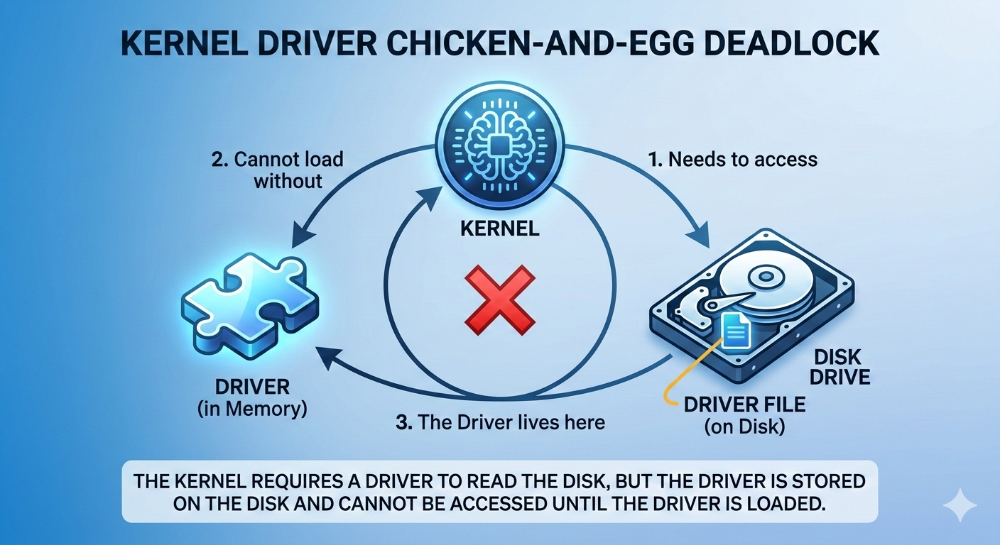
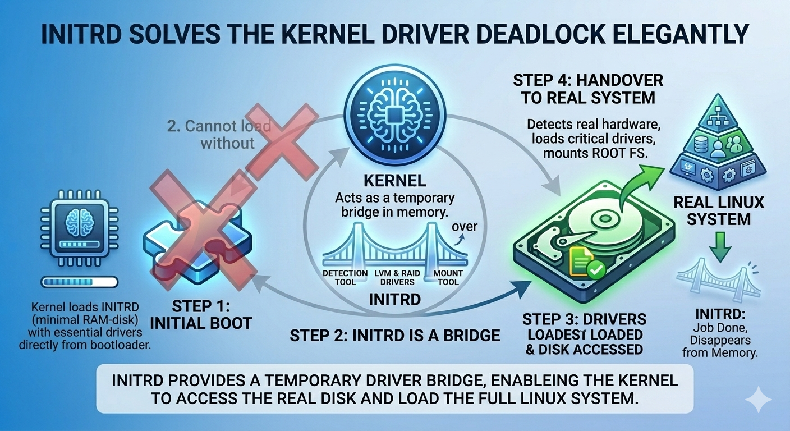

# 🐧 Linux Boot Process & System Logging

> **Learning Path:** Linux Fundamentals → Infrastructure Engineering → Cloud Engineering  
> **Level:** Beginner to Intermediate  
> **Goal:** Understand exactly what happens from the moment you press the power button to the moment you see the login screen — and how the system logs everything along the way.

---

## 📚 Table of Contents

1. [What We Will Learn](#what-we-will-learn)
2. [The Big Picture](#the-big-picture)
3. [Phase 1 — BIOS & POST](#phase-1--bios--post)
4. [Phase 2 — Boot Loader (GRUB)](#phase-2--boot-loader-grub)
5. [Phase 3 — initrd (Initial RAM Disk)](#phase-3--initrd-initial-ram-disk)
6. [Phase 4 — Linux Kernel](#phase-4--linux-kernel)
7. [Phase 5 — System Initialization (Runlevels & Targets)](#phase-5--system-initialization-runlevels--targets)
8. [System Logging](#system-logging)
9. [Shutdown & Reboot Commands](#shutdown--reboot-commands)
10. [Quick Reference Cheat Sheet](#quick-reference-cheat-sheet)
11. [Interview Questions](#interview-questions)
12. [Common Beginner Mistakes](#common-beginner-mistakes)

---

## What We Will Learn

- BIOS and what it does before Linux starts
- Boot Loaders (GRUB / LILO)
- The Linux Kernel and how it loads
- initrd — the temporary helper filesystem
- Runlevels and systemd Targets
- System logging with `dmesg` and `/var/log/dmesg`
- How to safely reboot and shutdown servers

---

## The Big Picture

Before diving into details, here is the complete story in one flow:

```
YOU PRESS THE POWER BUTTON ⚡
          │
          ▼
┌─────────────────────────────────┐
│  PHASE 1: BIOS Wakes Up         │  ← Checks hardware (POST)
│  Finds bootable disk            │  ← Reads MBR or GPT
└────────────────┬────────────────┘
                 │
                 ▼
┌─────────────────────────────────┐
│  PHASE 2: Boot Loader (GRUB)    │  ← Shows OS menu
│  Loads Kernel + initrd          │  ← From /boot directory
└────────────────┬────────────────┘
                 │
                 ▼
┌─────────────────────────────────┐
│  PHASE 3: initrd Activates      │  ← Loads disk/LVM drivers
│  Mounts real root filesystem    │  ← Then hands over to Kernel
└────────────────┬────────────────┘
                 │
                 ▼
┌─────────────────────────────────┐
│  PHASE 4: Linux Kernel Starts   │  ← Detects all hardware
│  Starts Process ID #1           │  ← systemd or init
└────────────────┬────────────────┘
                 │
                 ▼
┌─────────────────────────────────┐
│  PHASE 5: systemd Runs          │  ← Starts all services
│  Reads /etc/fstab, mounts disks │  ← Reaches default target
└────────────────┬────────────────┘
                 │
                 ▼
          LOGIN SCREEN 🖥️
```

---

## Phase 1 — BIOS & POST

### What is BIOS?

**BIOS** stands for **Basic Input/Output System**.

It is a special piece of **firmware** (software burned onto a chip on the motherboard). It is the **very first program** that runs when you press the power button — before Linux, before the disk, before anything.

```
Your Computer's Motherboard:
┌─────────────────────────────────────────────────┐
│                                                  │
│   [CPU]    [RAM Slots]    [BIOS CHIP] ← here    │
│                                                  │
│   [Disk Connectors]   [USB Ports]               │
│                                                  │
└─────────────────────────────────────────────────┘

The BIOS chip has its own tiny memory.
It works without any operating system.
```

### What is POST?

**POST** stands for **Power On Self Test**.

When BIOS wakes up, the first thing it does is run a health checkup on all hardware components:

```
BIOS runs POST:
┌────────────────────────────────────────────────┐
│  CPU working?            ✅ Yes                 │
│  RAM working?            ✅ Yes (16GB found)    │
│  Storage disk present?   ✅ Yes (/dev/sda)      │
│  Keyboard connected?     ✅ Yes                 │
│  Graphics card okay?     ✅ Yes                 │
│                                                  │
│  POST PASSED → Proceeding to find boot device   │
└────────────────────────────────────────────────┘
```

If POST **fails**, the system cannot boot and signals the problem using **beep codes**:

| Beep Pattern    | Meaning                 |
| --------------- | ----------------------- |
| 1 short beep    | POST passed — all good  |
| 3 beeps         | RAM problem             |
| 8 beeps         | Graphics card problem   |
| Continuous beep | RAM not seated properly |

> **Note:** Beep codes vary slightly between manufacturers (Dell, HP, Lenovo, etc.)

### Boot Device Search

After POST passes, BIOS searches for a bootable device using a **priority list**:

```
BIOS Boot Priority List:
┌─────────────────────────────────┐
│  Priority 1: USB Drive          │ ← Check first
│  Priority 2: Hard Disk (HDD)    │ ← Then here
│  Priority 3: DVD/CD Drive       │ ← Then here
│  Priority 4: Network (PXE)      │ ← Last resort
└─────────────────────────────────┘
```

> This is why plugging in a Linux installer USB boots from USB — because USB is Priority 1.
> You can change the priority order in BIOS settings (press F2, F12, or DEL at startup).

### BIOS vs UEFI

| Feature                 | BIOS (Old)          | UEFI (New)          |
| ----------------------- | ------------------- | ------------------- |
| Works with              | MBR partition table | GPT partition table |
| Max disk size supported | 2 TB                | 9.4 ZB              |
| Boot speed              | Slower              | Faster              |
| Security features       | None                | Secure Boot         |
| Interface               | Text-based          | Graphical           |
| Status                  | Being replaced      | Modern standard     |

---

## Phase 2 — Boot Loader (GRUB)

### What is a Boot Loader?

A Boot Loader is a small program that:

1. Shows you a menu to select which OS to boot (if multiple are installed)
2. Loads the Linux Kernel into memory
3. Loads the initrd (temporary helper) into memory
4. Passes control to the Kernel

### GRUB vs LILO

| Feature       | LILO                      | GRUB                      |
| ------------- | ------------------------- | ------------------------- |
| Stands for    | Linux Loader              | Grand Unified Boot Loader |
| Status        | Retired / outdated        | Modern standard           |
| Configuration | `/etc/lilo.conf`          | `/boot/grub/grub.cfg`     |
| Used today?   | Rarely (very old systems) | Yes — universally         |

> **In practice:** Always use GRUB. You will almost never encounter LILO on modern systems.

### The GRUB Menu

When your computer starts with multiple operating systems installed:

```
┌─────────────────────────────────────────────────────┐
│                    GNU GRUB 2.06                     │
│                                                      │
│  * Ubuntu 22.04 LTS                  ← Default      │
│    Ubuntu 22.04 LTS (recovery mode)                  │
│    Windows 10                                        │
│                                                      │
│  Use ↑↓ arrows to select. Press Enter to boot.     │
│  Booting Ubuntu in 5 seconds...                     │
└─────────────────────────────────────────────────────┘
```

### The /boot Directory

GRUB reads the Linux Kernel and initrd from the `/boot` directory:

```bash
ls -l /boot
```

```
/boot/
├── vmlinuz-6.5.0-1047-gcp      ← Linux Kernel (compressed)
├── initrd.img-6.5.0-1047-gcp   ← Temporary helper filesystem
├── initrd.img.old               ← Backup of previous initrd
├── vmlinuz.old                  ← Backup of previous kernel
├── config-6.5.0-1047-gcp       ← Kernel build configuration
└── grub/                        ← GRUB configuration files
    └── grub.cfg
```

### What is vmlinuz?

```
vm    = Virtual Memory support
linu  = Linux
z     = compressed (like a zip file, smaller on disk)

vmlinuz = "Compressed Linux Kernel"
```

When GRUB loads it, the kernel decompresses itself into RAM — like unzipping a file.

---

## Phase 3 — initrd (Initial RAM Disk)

### The Chicken-or-Egg Problem

```
The Kernel wants to boot.
To boot, it needs to read the hard disk.
To read the hard disk, it needs disk drivers.
But the disk drivers are stored ON the hard disk.

PROBLEM:
  "I need the disk to get the drivers,
   but I need the drivers to read the disk!"

   🐔 Chicken or Egg? 🥚
```

## 

### How initrd Solves It

**initrd** = **Initial RAM Disk**

It is a **tiny temporary filesystem** loaded into RAM by GRUB. It contains just enough tools and drivers to:

1. Detect the real hard disk
2. Load required drivers (including LVM, RAID if needed)
3. Mount the real root filesystem `/`
4. Hand over to the real Linux system
5. Disappear from memory (job done)

```
GRUB loads initrd into RAM:
┌─────────────────────────────────────────┐
│  RAM                                    │
│  ┌──────────────────────────────────┐   │
│  │  initrd (tiny temporary system)  │   │
│  │  Contains:                       │   │
│  │  ✅ Disk drivers                 │   │
│  │  ✅ LVM tools  ← KEY for LVM!   │   │
│  │  ✅ RAID tools                   │   │
│  │  ✅ Filesystem drivers           │   │
│  └──────────────────────────────────┘   │
└─────────────────────────────────────────┘
           │
           ▼ Uses these tools to find real disk
           ▼ Mounts real root filesystem
           ▼ initrd disappears
           ▼
    Real Linux system takes over
```

### Why initrd Matters for LVM

> This is a critical connection to LVM storage management.

If your root filesystem `/` lives on an **LVM Logical Volume**:

```
Without initrd knowing about LVM:
  Kernel starts → wants to mount / → / is on LVM volume
  → Kernel has no LVM tools → CANNOT find / → KERNEL PANIC 💥

With initrd including LVM modules:
  initrd starts → loads LVM module → activates Volume Group
  → finds Logical Volume where / lives → mounts /
  → Kernel boots normally ✅
```

**Sequence when root is on LVM:**

```
initrd loads LVM kernel module
      ↓
Scans for Volume Groups (vgscan)
      ↓
Activates Volume Groups (vgchange -ay)
      ↓
Finds the Logical Volume for /
      ↓
Mounts it as root filesystem
      ↓
Kernel continues booting normally
```

## 

---

## Phase 4 — Linux Kernel

### What is the Kernel?

The Kernel is the **heart and brain of Linux**. It is the boss of all hardware and software on the system.

```
LINUX KERNEL responsibilities:
┌─────────────────────────────────────────────────────┐
│  🧠 CPU Management      — who gets to run code      │
│  📝 RAM Management      — who gets memory           │
│  💽 Disk Management     — reading and writing files  │
│  🌐 Network Management  — sending/receiving data    │
│  🔌 Hardware Management — talking to devices        │
│  🔒 Security            — who can do what           │
└─────────────────────────────────────────────────────┘
```

### What Kernel Does During Boot

```
Step 1: Decompresses itself from vmlinuz into RAM
Step 2: Detects all hardware (CPU, RAM, disks, network cards)
Step 3: Mounts the real root filesystem /
        (uses initrd help if / is on LVM or RAID)
Step 4: Starts Process ID #1 → systemd (or init on older systems)
Step 5: Steps back — systemd manages everything from here
```

### Kernel Ring Buffer and dmesg

During boot, the kernel generates thousands of messages (hardware detected, drivers loaded, etc.). Your screen is not ready during early boot, so these messages go to the **Kernel Ring Buffer** — a circular log stored in RAM.

```
KERNEL RING BUFFER = Circular notepad in RAM

"Ring" = When full, oldest message is overwritten by newest.

Contents:
  [0.000000] Linux version 6.5.0-1047-gcp
  [0.000000] CPU: Intel Xeon @ 2.20GHz
  [0.019995] ACPI: RSDP found
  [1.234567] scsi host0: SCSI emulation
  [1.567890] sd 0:0:0:0: [sda] 419430400 blocks — disk found!
  [2.100000] EXT4-fs: mounted filesystem
  ...thousands more lines...
```

**Commands to read kernel messages:**

```bash
# View all kernel boot messages
dmesg

# View with human-readable timestamps
dmesg -T

# Watch kernel messages live (as they are generated)
dmesg -w

# View saved boot messages from log file
cat /var/log/dmesg
```

**Example dmesg output:**

```
[    0.000000] Linux version 6.5.0-1047-gcp
[    0.000000] BIOS-provided physical RAM map:
[    0.019995] ACPI: RSDP 0x00000000000F05B0 00014
[    1.234567] sd 0:0:0:0: [sda] Attached SCSI disk
[    2.345678] EXT4-fs (sda1): mounted filesystem
```

> Numbers in `[ ]` = seconds elapsed since power-on

---

## Phase 5 — System Initialization (Runlevels & Targets)

### What Are Runlevels?

Runlevels define **what state the system is in** — which services are running, whether a GUI is active, whether multiple users can log in, etc.

```
RUNLEVEL 0  → SHUTDOWN       (power off the system)
RUNLEVEL 1  → SINGLE USER    (maintenance / safe mode, admin only)
RUNLEVEL 2  → MULTI USER     (no network file sharing, rarely used)
RUNLEVEL 3  → FULL MULTI USER, NO GUI  ← servers use this
RUNLEVEL 4  → UNDEFINED / CUSTOM
RUNLEVEL 5  → FULL MULTI USER, WITH GUI  ← desktops use this
RUNLEVEL 6  → REBOOT         (restart the system)
```

> **Production note:** All Linux servers in GCP, AWS, and Azure run at Runlevel 3 equivalent. GUI consumes CPU and RAM that should be dedicated to the application.

### The Old Way — init

```
Program: init
Config file: /etc/inittab

Example entry in /etc/inittab:
id:5:initdefault:   ← "Boot to runlevel 5 by default"

Change runlevel manually:
telinit 3    ← Switch to runlevel 3 now (no GUI)
telinit 5    ← Switch to runlevel 5 now (with GUI)
telinit 0    ← Shutdown now
telinit 6    ← Reboot now
```

### The Modern Way — systemd

`systemd` has replaced `init` on almost all modern Linux distributions. Instead of runlevel numbers, it uses **Targets**.

**Runlevel → systemd Target Mapping:**

| Old Runlevel | systemd Target      | Purpose                   |
| ------------ | ------------------- | ------------------------- |
| 0            | `poweroff.target`   | Shutdown                  |
| 1            | `rescue.target`     | Single-user / maintenance |
| 2, 3, 4      | `multi-user.target` | Server mode (no GUI)      |
| 5            | `graphical.target`  | Desktop mode (with GUI)   |
| 6            | `reboot.target`     | Reboot                    |

**Targets are the real destinations. Old runlevel names are symlinks pointing to them:**

```bash
ls -l /lib/systemd/system/runlevel*.target
```

```
runlevel0.target → poweroff.target
runlevel1.target → rescue.target
runlevel2.target → multi-user.target
runlevel3.target → multi-user.target
runlevel4.target → multi-user.target
runlevel5.target → graphical.target
runlevel6.target → reboot.target
```

**systemd commands:**

```bash
# See the current default target
systemctl get-default

# Change default target (persists across reboots)
sudo systemctl set-default multi-user.target    # Server mode
sudo systemctl set-default graphical.target     # Desktop mode

# Switch target immediately (no reboot required)
sudo systemctl isolate multi-user.target
sudo systemctl isolate graphical.target
sudo systemctl isolate reboot.target            # Reboot now
sudo systemctl isolate poweroff.target          # Shutdown now
```

---

## System Logging

### Where Kernel Messages Are Stored

```
Kernel Ring Buffer (RAM)     → view with: dmesg
Saved to file                → /var/log/dmesg
Ongoing system logs          → /var/log/syslog  (Debian/Ubuntu)
                             → /var/log/messages (RHEL/CentOS)
```

### Useful Log Commands

```bash
# View kernel boot messages
dmesg
dmesg -T                    # With human-readable timestamps
dmesg | grep -i error       # Filter only errors
dmesg | grep -i sda         # Filter disk-related messages

# View system logs (Debian/Ubuntu)
cat /var/log/syslog
tail -f /var/log/syslog     # Watch live (Ctrl+C to stop)

# View all logs with systemd's journal (modern way)
journalctl                  # All logs
journalctl -b               # Logs since last boot only
journalctl -b -1            # Logs from previous boot
journalctl -f               # Watch live (like tail -f)
journalctl -u ssh           # Logs for SSH service only
journalctl --since "1 hour ago"
```

---

## Shutdown & Reboot Commands

### All Ways to Reboot

```bash
sudo reboot                          # Reboot immediately
sudo systemctl isolate reboot.target # Modern way
sudo telinit 6                       # Old way (init)
sudo shutdown -r now                 # shutdown command
```

### All Ways to Shutdown (Power Off)

```bash
sudo poweroff                            # Shutdown immediately
sudo systemctl isolate poweroff.target   # Modern way
sudo telinit 0                           # Old way (init)
sudo shutdown -h now                     # shutdown command
```

### The shutdown Command

```
Syntax: shutdown [options] time [message]

Options:
  -r   Reboot after shutdown
  -h   Halt (power off) after shutdown
  -c   Cancel a scheduled shutdown

Time formats:
  now     Immediately
  +10     In 10 minutes from now
  15:30   At 3:30 PM today
```

**Examples:**

```bash
# Reboot in 15 minutes with a warning to all users
sudo shutdown -r +15 "Server rebooting for maintenance in 15 minutes!"

# Reboot at exactly 11:30 PM tonight
sudo shutdown -r 23:30 "Scheduled maintenance reboot"

# Reboot right now
sudo shutdown -r now

# Power off right now
sudo shutdown -h now

# Cancel a previously scheduled shutdown
sudo shutdown -c
```

> **Important:** The message you include is **broadcast to ALL logged-in users** using the `wall` command. Always include a message when rebooting shared production servers.

---

## Quick Reference Cheat Sheet

```bash
# ── VIEWING BOOT & KERNEL MESSAGES ─────────────────────
dmesg                          # All kernel messages
dmesg -T                       # With human-readable timestamps
dmesg -w                       # Watch live
dmesg | grep -i error          # Filter errors only
cat /var/log/dmesg             # Saved kernel messages from last boot

# ── SYSTEMD / TARGETS ────────────────────────────────────
systemctl get-default          # See current default target
sudo systemctl set-default graphical.target     # Set GUI default
sudo systemctl set-default multi-user.target    # Set server default
sudo systemctl isolate multi-user.target        # Switch now (no reboot)
sudo systemctl isolate graphical.target         # Switch to GUI now

# ── REBOOT ───────────────────────────────────────────────
sudo reboot
sudo shutdown -r now
sudo shutdown -r +15 "Rebooting soon"           # With warning message
sudo telinit 6                                  # Old style

# ── SHUTDOWN ─────────────────────────────────────────────
sudo poweroff
sudo shutdown -h now
sudo shutdown -h 23:30 "Going offline overnight"
sudo telinit 0                                  # Old style

# ── CANCEL SCHEDULED SHUTDOWN ────────────────────────────
sudo shutdown -c

# ── SYSTEM LOGS ──────────────────────────────────────────
journalctl                     # All systemd logs
journalctl -b                  # Since last boot
journalctl -f                  # Watch live
journalctl -u sshd             # Logs for a specific service
```

---

## Interview Questions

**Beginner Level:**

- What does POST stand for and what does it do?
- What is GRUB and what is its job in the boot process?
- What is the difference between BIOS and UEFI?
- What is the difference between runlevel 3 and runlevel 5?
- What command would you use to reboot a server in 10 minutes with a warning message?

**Intermediate Level:**

- Explain the Linux boot sequence from power-on to login screen.
- What is initrd and what problem does it solve?
- Why does initrd need to include LVM modules?
- What replaced `init` in modern Linux systems and what are `targets`?
- How do you view kernel messages from the last boot?

**Senior Level:**

- The system gets a kernel panic during boot. Walk me through your troubleshooting steps.
- Your root filesystem is on an LVM volume and the server won't boot. What could be wrong with initrd and how would you fix it?
- What is the difference between `journalctl -b` and `dmesg`?
- How would you change the default boot target on a headless cloud server?

---

## Common Beginner Mistakes

**1. Confusing BIOS chip with hard disk**
BIOS is firmware on the motherboard chip — it is NOT on your hard disk and does NOT disappear when you format a disk.

**2. Thinking GRUB is part of Linux**
GRUB is a separate program. It runs before Linux starts. It loads Linux. They are different things.

**3. Forgetting that initrd is temporary**
initrd loads into RAM and disappears after the real filesystem is mounted. It does not permanently live anywhere on the disk that you can access normally.

**4. Using `telinit` on modern systemd systems**
On modern systems, `telinit` still works but `systemctl isolate` is the correct modern approach.

**5. Not including a message when rebooting shared servers**
Always use `sudo shutdown -r +10 "your message"` so other engineers are warned before the server goes down.

**6. Confusing `dmesg` with `/var/log/syslog`**
`dmesg` shows kernel-level hardware messages from boot. `/var/log/syslog` shows ongoing system and application messages. They are different logs.

---

## Summary

```
BIOS       → Firmware on motherboard chip. Runs POST. Finds boot disk.
POST       → Hardware health check. Beep codes signal failures.
GRUB       → Boot loader. Shows OS menu. Loads Kernel + initrd.
/boot      → Directory containing kernel (vmlinuz) and initrd.
initrd     → Temporary RAM-based helper. Solves the chicken-egg problem.
           → Includes LVM modules so / can live on LVM volumes.
Kernel     → Heart of Linux. Manages all hardware. Starts systemd.
dmesg      → Command to read kernel's ring buffer (boot messages).
systemd    → Replaces init. Starts all services. Uses targets.
Targets    → Modern replacement for runlevel numbers.
Runlevel 3 → Server mode (no GUI). Used on all production servers.
Runlevel 5 → Desktop mode (with GUI). Used on personal computers.
```

---


