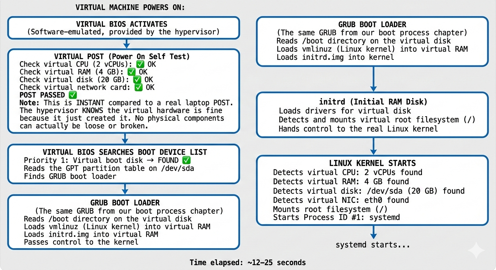
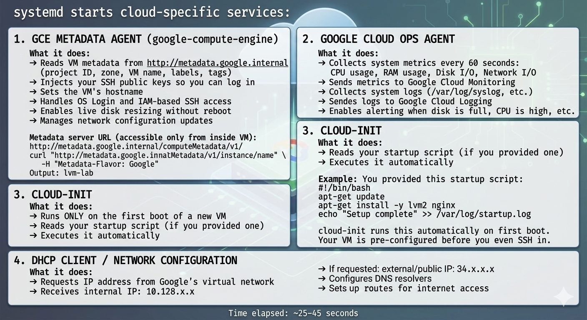

# ☁️ Cloud VM Creation & Boot Process

> **Learning Path:** Linux Fundamentals → Infrastructure Engineering → Cloud Engineering  
> **Level:** Beginner to Intermediate  
> **Goal:** Understand exactly what happens — step by step — from the moment you click "Create Instance" on Google Cloud (or AWS) to the moment you see a ready terminal prompt. And understand how this compares to pressing the power button on your laptop.

---

## 📚 Table of Contents

1. [What We Will Learn](#what-we-will-learn)
2. [What "The Cloud" Actually Is](#what-the-cloud-actually-is)
3. [The Key Technology — Virtualization](#the-key-technology--virtualization)
4. [The Hypervisor — The Apartment Manager](#the-hypervisor--the-apartment-manager)
5. [Local Boot vs Cloud VM Boot — The Comparison](#local-boot-vs-cloud-vm-boot--the-comparison)
6. [The Complete Journey — Click to Ready VM](#the-complete-journey--click-to-ready-vm)
7. [Stage 1 — Your Request Travels to Google](#stage-1--your-request-travels-to-google)
8. [Stage 2 — Google's Control Plane Processes the Request](#stage-2--googles-control-plane-processes-the-request)
9. [Stage 3 — The Disk is Created and OS Image is Copied](#stage-3--the-disk-is-created-and-os-image-is-copied)
10. [Stage 4 — Virtual Hardware is Assembled](#stage-4--virtual-hardware-is-assembled)
11. [Stage 5 — Virtual BIOS and the Boot Process](#stage-5--virtual-bios-and-the-boot-process)
12. [Stage 6 — Cloud-Specific Services Activate](#stage-6--cloud-specific-services-activate)
13. [Stage 7 — You SSH Into the VM](#stage-7--you-ssh-into-the-vm)
14. [Local vs Cloud — Full Comparison Table](#local-vs-cloud--full-comparison-table)
15. [GCP vs AWS — How They Differ](#gcp-vs-aws--how-they-differ)
16. [Why This Matters for LVM](#why-this-matters-for-lvm)
17. [Quick Reference Cheat Sheet](#quick-reference-cheat-sheet)
18. [Interview Questions](#interview-questions)
19. [Common Beginner Mistakes](#common-beginner-mistakes)

---

## What We Will Learn

- What "the cloud" physically is — not magic, real hardware
- What virtualization is and how it works
- What a hypervisor does and why it matters
- Every single step from clicking "Create Instance" to a ready VM
- How the cloud boot process compares to a local laptop boot
- What cloud-specific components do (GCE agent, cloud-init, metadata)
- Why GCP Persistent Disks are ideal for learning storage concepts like LVM

---

## What "The Cloud" Actually Is

The most important mental model to fix first:

```
What most people think the cloud is:
        ☁️   ☁️   ☁️
    Magical floating computers
    somewhere in the sky

What the cloud ACTUALLY is:
┌──────────────────────────────────────────────────────────────┐
│              GOOGLE DATA CENTER                              │
│         (A massive warehouse in Iowa, Singapore, etc.)       │
│                                                              │
│  🖥️ 🖥️ 🖥️ 🖥️ 🖥️ 🖥️ 🖥️ 🖥️ 🖥️ 🖥️ 🖥️ 🖥️ 🖥️ 🖥️  │
│  🖥️ 🖥️ 🖥️ 🖥️ 🖥️ 🖥️ 🖥️ 🖥️ 🖥️ 🖥️ 🖥️ 🖥️ 🖥️ 🖥️  │
│  🖥️ 🖥️ 🖥️ 🖥️ 🖥️ 🖥️ 🖥️ 🖥️ 🖥️ 🖥️ 🖥️ 🖥️ 🖥️ 🖥️  │
│                                                              │
│  Tens of thousands of REAL physical servers                  │
│  Each has: CPU, RAM, Disk, Network cards                     │
│  Running 24 hours a day, 7 days a week                       │
│  Kept in air-conditioned, secure, redundant facilities       │
└──────────────────────────────────────────────────────────────┘
```

When you create a VM on GCP or AWS, you are **renting a slice** of one of these real physical servers. Google (or Amazon) owns the hardware. You pay only for the time and resources you use.

### Google Cloud Regions and Zones

```
REGION: A geographic area containing data centers
ZONE:   A specific data center within a region

Examples:
  us-central1       → Iowa, USA (region)
  us-central1-a     → Specific data center in Iowa (zone)
  us-central1-b     → Different data center, same city (zone)
  asia-south1       → Mumbai, India (region)
  asia-south1-a     → Specific Mumbai data center (zone)

When you specify --zone=us-central1-a
Your VM runs on a physical server inside that specific building.
```

---

## The Key Technology — Virtualization

### The Apartment Building Story

Google owns a **massive physical server** (the building). Instead of giving the entire building to one customer, they divide it into apartments and rent each one independently.

```
GOOGLE'S ONE PHYSICAL SERVER:
┌──────────────────────────────────────────────────────────────┐
│  Physical CPU:    128 cores                                  │
│  Physical RAM:    512 GB                                     │
│  Physical Disk:   Connected to distributed storage          │
│  Physical Network: 100 Gbps                                  │
├─────────────────┬────────────────┬───────────────────────────┤
│   YOUR VM       │  Another VM    │  Another company's VM     │
│                 │                │                           │
│  2 vCPU cores   │  8 vCPU cores  │  32 vCPU cores            │
│  4 GB RAM       │  16 GB RAM     │  128 GB RAM               │
│  20 GB disk     │  100 GB disk   │  1 TB disk                │
│                 │                │                           │
│  (Apartment 1)  │  (Apartment 2) │  (Apartment 3)            │
└─────────────────┴────────────────┴───────────────────────────┘

All three VMs run simultaneously on the same physical server.
Each thinks it is a completely independent computer.
None can see or touch the others' data.
```

### What is a vCPU?

```
Physical CPU core:  A real processing unit soldered onto the server
vCPU (virtual CPU): A share of a real CPU core given to your VM

Your e2-medium VM gets 2 vCPUs:
  → You get the processing power of 2 CPU cores
  → They may be 2 dedicated cores, or time-shared from more cores
  → Your OS sees them as 2 real CPUs — it cannot tell the difference
```

### The Genius of Virtualization

```
From the Operating System's perspective:

  Running on real hardware    ≡    Running inside a VM

Linux sees:  CPU ✅  RAM ✅  Disk ✅  Network ✅
Linux does NOT know these are virtual resources.
The OS just boots and runs normally.

This is the entire foundation of cloud computing.
```

---

## The Hypervisor — The Apartment Manager

The **hypervisor** is the software layer that creates, manages, and isolates virtual machines on a physical host.

```
PHYSICAL SERVER HARDWARE
         │
         ▼
┌──────────────────────────────────────────────────────────────┐
│                      HYPERVISOR                              │
│              (The Apartment Building Manager)                │
│                                                              │
│  Responsibilities:                                           │
│  ✅ Divide physical CPU/RAM/Disk into virtual slices         │
│  ✅ Create new VMs on demand (when you click "Create")       │
│  ✅ Ensure VMs are completely isolated from each other       │
│  ✅ Manage resource allocation fairly between all VMs        │
│  ✅ Handle VM lifecycle: start, stop, pause, migrate         │
│  ✅ Provide virtual BIOS/UEFI to each VM                     │
│  ✅ Enable snapshots and live migration                       │
└──────────────────────────────────────────────────────────────┘
         │              │               │
         ▼              ▼               ▼
      VM 1           VM 2           VM 3
   (Your VM)     (Customer B)   (Customer C)
```

### Hypervisor Types

| Type                    | Description                                                              | Examples                                                |
| ----------------------- | ------------------------------------------------------------------------ | ------------------------------------------------------- |
| **Type 1 (Bare Metal)** | Runs directly on physical hardware — no host OS needed. Most performant. | KVM (Google), Nitro (AWS), Hyper-V (Azure), VMware ESXi |
| **Type 2 (Hosted)**     | Runs on top of a regular OS. Used for local development.                 | VirtualBox, VMware Workstation                          |

### Who Uses What

| Cloud Provider                | Hypervisor Technology                     |
| ----------------------------- | ----------------------------------------- |
| **Google Cloud (GCP)**        | KVM (Kernel-based Virtual Machine)        |
| **Amazon Web Services (AWS)** | Nitro (custom-built, evolved from Xen)    |
| **Microsoft Azure**           | Hyper-V (Microsoft's hypervisor)          |
| **Your laptop (local dev)**   | VirtualBox or VMware Workstation (Type 2) |

---

## Local Boot vs Cloud VM Boot — The Comparison

```
YOUR LAPTOP BOOT                     CLOUD VM (GCP/AWS) CREATION + BOOT
─────────────────────────────────    ──────────────────────────────────────────
You press physical POWER button  →   You click "Create Instance" in browser
                                     OR run: gcloud compute instances create

Real physical hardware powers on →   Hypervisor ALLOCATES virtual hardware
                                     (vCPU cores reserved, RAM reserved)

Real BIOS chip activates         →   Software-emulated virtual BIOS activates
(chip is soldered on motherboard)    (hypervisor provides this in software)

POST checks real hardware        →   Virtual POST (instant — hypervisor knows
(can fail if RAM is broken, etc.)    all virtual hardware is working)

BIOS searches real boot devices  →   VM looks at its virtual boot disk
(real USB, HDD, DVD drive)           (a file in Google's storage system)

OS was installed by you          →   Google pre-copied OS image to your disk
                                     (Debian/Ubuntu/RHEL — your choice)

GRUB loads from disk             →   GRUB loads from virtual disk
                                     ← IDENTICAL from here →

initrd loads                     →   initrd loads          (same)
Linux Kernel starts              →   Linux Kernel starts   (same)
systemd starts services          →   systemd starts services (same)
                                     PLUS: Cloud agents start (extra step)

You type at physical keyboard    →   You SSH in from your laptop remotely

Total time: 30–90 seconds        →   Total time: 30–60 seconds
```

### The Key Takeaway

```
┌───────────────────────────────────────────────────────────┐
│  EVERYTHING from GRUB onwards is IDENTICAL.               │
│                                                           │
│  Local laptop:                                            │
│    BIOS → GRUB → initrd → Kernel → systemd → Login       │
│                                                           │
│  Cloud VM:                                                │
│    Virtual BIOS → GRUB → initrd → Kernel → systemd       │
│    → Cloud Agents → SSH Ready                             │
│                                                           │
│  The OS cannot tell whether it is on real or virtual      │
│  hardware. The boot process is the same.                  │
└───────────────────────────────────────────────────────────┘
```

---

## The Complete Journey — Click to Ready VM

Here is every step that happens when you run:

```bash
gcloud compute instances create lvm-lab \
  --zone=us-central1-a \
  --machine-type=e2-medium \
  --image-family=debian-11 \
  --image-project=debian-cloud \
  --boot-disk-size=20GB
```

```
TOTAL TIMELINE:
├── Stage 1: Request travels to Google          (~0.1–0.3 sec)
├── Stage 2: Control Plane processes request    (~1–3 sec)
├── Stage 3: Disk created, OS image copied      (~3–8 sec)
├── Stage 4: Virtual hardware assembled         (~8–12 sec)
├── Stage 5: VM boots (BIOS→GRUB→Kernel)        (~12–25 sec)
├── Stage 6: Cloud agents activate              (~25–45 sec)
└── Stage 7: VM ready, you SSH in              (~45–60 sec)
```

---

## Stage 1 — Your Request Travels to Google

```
YOUR LAPTOP (Pune, India)
│
│  You run the gcloud command.
│
│  The gcloud CLI tool converts your command into
│  an HTTPS API request:
│
│  POST https://compute.googleapis.com/compute/v1/
│       projects/YOUR_PROJECT/zones/us-central1-a/instances
│
│  Request body (JSON):
│  {
│    "name": "lvm-lab",
│    "machineType": "zones/us-central1-a/machineTypes/e2-medium",
│    "disks": [{ "initializeParams": { "diskSizeGb": "20",
│                "sourceImage": "debian-11" }}],
│    "networkInterfaces": [{}]
│  }
│
│  This HTTPS request travels:
│  Your WiFi → ISP → Internet backbone →
│  Submarine cables → Google's network → Iowa data center
│
▼
GOOGLE DATA CENTER (us-central1-a, Iowa, USA)

Time elapsed: ~100–300 milliseconds
```


---

## Stage 2 — Google's Control Plane Processes the Request

The **Control Plane** is Google's massive distributed system that manages everything in Google Cloud.

```
GOOGLE CLOUD CONTROL PLANE receives your request:
│
├── STEP 1: Authentication
│   "Is this a valid Google account?"
│   "Does the OAuth token match?"
│   → ✅ Authenticated
│
├── STEP 2: Authorization (IAM check)
│   "Does this account have compute.instances.create permission?"
│   "Is this project active and accessible?"
│   → ✅ Authorized
│
├── STEP 3: Billing check
│   "Is billing enabled on this project?"
│   "Is there a valid payment method?"
│   → ✅ Billing active
│
├── STEP 4: Quota check
│   "Does this project have enough vCPU quota in us-central1?"
│   "Is there enough disk quota for 20GB?"
│   "Is the IP address quota available?"
│   → ✅ Quota available
│
├── STEP 5: Resource scheduling
│   "Which physical server in us-central1-a has:"
│   "  - 2+ free vCPU cores?"
│   "  - 4+ GB free RAM?"
│   "  - Network capacity available?"
│   The scheduler scans thousands of servers...
│   → ✅ Server RACK-17, HOST-42 selected
│
└── STEP 6: Persistent Disk provisioning
    "Allocate a new 20GB Persistent Disk in us-central1-a"
    → ✅ Disk allocated

Time elapsed: ~1–3 seconds
```

---


---

## Stage 3 — The Disk is Created and OS Image is Copied

This is one of the most important steps that most engineers never think about.

```
GOOGLE'S PERSISTENT DISK SERVICE:

Step 1: A new virtual 20GB disk is created
        (Not a physical disk — space in Google's
        distributed storage system, replicated 3x
        across different physical drives for safety)

Step 2: Google maintains MASTER OS IMAGES
        (Clean, freshly-installed OS snapshots)

        Available images:
        debian-11           ← Debian 11 Bullseye
        ubuntu-2204-lts     ← Ubuntu 22.04 LTS
        rhel-9              ← Red Hat Enterprise Linux 9
        windows-2022        ← Windows Server 2022
        ...and hundreds more

Step 3: The Debian 11 master image is CLONED
        onto your new 20GB disk:

        ┌──────────────────────────────────────────┐
        │  YOUR VM'S BOOT DISK (20GB)              │
        │                                          │
        │  Partition layout (GPT):                 │
        │  /dev/sda1 → /boot  (GRUB, kernel,       │
        │                       initrd — ~1GB)     │
        │  /dev/sda2 → /      (Debian 11 OS files  │
        │                       ~18GB)             │
        │                                          │
        │  Contents:                               │
        │  ✅ GRUB boot loader configured          │
        │  ✅ Linux kernel (vmlinuz)               │
        │  ✅ initrd image                         │
        │  ✅ Complete Debian 11 OS                │
        │  ✅ SSH server installed                 │
        │  ✅ GCE agent pre-installed              │
        │  ✅ systemd configured                   │
        └──────────────────────────────────────────┘

        This is like buying a laptop that comes with
        the OS pre-installed from the factory.
        Google pre-installed Debian 11 on your virtual disk.

Time elapsed: ~3–8 seconds
```

---


---

### What is a Persistent Disk?

```
LOCAL LAPTOP DISK:
  A physical SSD/HDD inside your laptop
  If you drop your laptop → disk can break
  Data is on ONE physical device

GCP PERSISTENT DISK:
  NOT a physical disk inside one server
  It is storage space in Google's distributed storage network
  Your data is automatically replicated across
  multiple physical drives in multiple racks

  Benefits:
  ✅ VM can be deleted — disk still exists independently
  ✅ Disk can be detached from one VM, attached to another
  ✅ Automatic redundancy — no single point of failure
  ✅ Can be snapshotted (backup) in seconds
  ✅ Can be resized while the VM is running (live resize)
  ✅ Survives physical hardware failures transparently
```

---

## Stage 4 — Virtual Hardware is Assembled

The hypervisor on the selected physical host receives the instruction to create your VM:

```
HYPERVISOR (KVM) on physical host server:

Receives: "Create VM with these specifications"

Assembling virtual hardware:

┌─────────────────────────────────────────────────────────────┐
│  VIRTUAL MACHINE: lvm-lab                                   │
│                                                             │
│  vCPU: 2 virtual cores                                     │
│  → Mapped to 2 real CPU cores on the physical server       │
│  → VM's OS sees: 2 CPUs available                          │
│                                                             │
│  RAM: 4 GB virtual memory                                  │
│  → 4GB of the physical server's RAM is reserved            │
│  → VM's OS sees: 4GB RAM available                         │
│                                                             │
│  Boot Disk: 20GB virtual block device                      │
│  → Connected to Google's Persistent Disk storage           │
│  → VM's OS sees: /dev/sda — a 20GB disk                   │
│                                                             │
│  Network Interface: Virtual NIC                            │
│  → Connected to Google's software-defined network (VPC)   │
│  → VM's OS sees: eth0 network interface                    │
│                                                             │
│  Virtual BIOS/UEFI: Software-emulated firmware             │
│  → Provided entirely by the hypervisor                     │
│  → No physical chip — pure software                        │
└─────────────────────────────────────────────────────────────┘

Time elapsed: ~8–12 seconds
```

---

## Stage 5 — Virtual BIOS and the Boot Process

**This stage is nearly identical to your laptop's boot process.**

```
VIRTUAL MACHINE POWERS ON:

┌─────────────────────────────────────────────────────────────┐
│  VIRTUAL BIOS ACTIVATES                                     │
│  (Software-emulated, provided by the hypervisor)            │
└──────────────────────────────┬──────────────────────────────┘
                               │
                               ▼
┌─────────────────────────────────────────────────────────────┐
│  VIRTUAL POST (Power On Self Test)                          │
│                                                             │
│  Check virtual CPU (2 vCPUs):     ✅ OK                    │
│  Check virtual RAM (4 GB):        ✅ OK                    │
│  Check virtual disk (20 GB):      ✅ OK                    │
│  Check virtual network card:      ✅ OK                    │
│                                                             │
│  POST PASSED ✅                                             │
│                                                             │
│  Note: This is INSTANT compared to a real laptop POST.     │
│  The hypervisor KNOWS the virtual hardware is fine         │
│  because it just created it. No physical components        │
│  can actually be loose or broken.                          │
└──────────────────────────────┬──────────────────────────────┘
                               │
                               ▼
┌─────────────────────────────────────────────────────────────┐
│  VIRTUAL BIOS SEARCHES BOOT DEVICE LIST                     │
│  Priority 1: Virtual boot disk → FOUND ✅                  │
│  Reads the GPT partition table on /dev/sda                  │
│  Finds GRUB boot loader                                     │
└──────────────────────────────┬──────────────────────────────┘
                               │
                               ▼
┌─────────────────────────────────────────────────────────────┐
│  GRUB BOOT LOADER                                           │
│  (The same GRUB from our boot process chapter)             │
│                                                             │
│  Reads /boot directory on the virtual disk                  │
│  Loads vmlinuz (Linux kernel) into virtual RAM              │
│  Loads initrd.img into virtual RAM                          │
│  Passes control to the kernel                               │
└──────────────────────────────┬──────────────────────────────┘
                               │
                               ▼
┌─────────────────────────────────────────────────────────────┐
│  initrd (Initial RAM Disk)                                  │
│  Loads drivers for virtual disk                             │
│  Detects and mounts virtual root filesystem (/)             │
│  Hands control to the real Linux kernel                     │
└──────────────────────────────┬──────────────────────────────┘
                               │
                               ▼
┌─────────────────────────────────────────────────────────────┐
│  LINUX KERNEL STARTS                                        │
│                                                             │
│  Detects virtual CPU:     2 vCPUs found                    │
│  Detects virtual RAM:     4 GB found                       │
│  Detects virtual disk:    /dev/sda (20 GB) found           │
│  Detects virtual NIC:     eth0 found                       │
│                                                             │
│  Mounts root filesystem (/)                                 │
│  Starts Process ID #1: systemd                             │
└──────────────────────────────┬──────────────────────────────┘
                               │
                               ▼
                      systemd starts...

Time elapsed: ~12–25 seconds
```

---



---

---

## Stage 6 — Cloud-Specific Services Activate

After the standard Linux boot, **cloud-specific agents and services** start. This is the only step that differs significantly from a local laptop boot.

```
systemd starts cloud-specific services:

┌─────────────────────────────────────────────────────────────┐
│  1. GCE METADATA AGENT (google-compute-engine)              │
│                                                             │
│  What it does:                                              │
│  → Reads VM metadata from http://metadata.google.internal  │
│    (project ID, zone, VM name, labels, tags)               │
│  → Injects your SSH public keys so you can log in          │
│  → Sets the VM's hostname                                   │
│  → Handles OS Login and IAM-based SSH access               │
│  → Enables live disk resizing without reboot               │
│  → Manages network configuration updates                    │
│                                                             │
│  Metadata server URL (accessible only from inside VM):      │
│  http://metadata.google.internal/computeMetadata/v1/        │
│  curl "http://metadata.google.internal/computeMetadata/v1/instance/name" \
│       -H "Metadata-Flavor: Google"                          │
│  Output: lvm-lab                                            │
└─────────────────────────────────────────────────────────────┘

┌─────────────────────────────────────────────────────────────┐
│  2. GOOGLE CLOUD OPS AGENT                                  │
│                                                             │
│  What it does:                                              │
│  → Collects system metrics every 60 seconds:               │
│    CPU usage, RAM usage, Disk I/O, Network I/O             │
│  → Sends metrics to Google Cloud Monitoring                 │
│  → Collects system logs (/var/log/syslog, etc.)            │
│  → Sends logs to Google Cloud Logging                       │
│  → Enables alerting when disk is full, CPU is high, etc.   │
└─────────────────────────────────────────────────────────────┘

┌─────────────────────────────────────────────────────────────┐
│  3. CLOUD-INIT                                              │
│                                                             │
│  What it does:                                              │
│  → Runs ONLY on the first boot of a new VM                 │
│  → Reads your startup script (if you provided one)         │
│  → Executes it automatically                               │
│                                                             │
│  Example: You provided this startup script:                 │
│  #!/bin/bash                                                │
│  apt-get update                                             │
│  apt-get install -y lvm2 nginx                              │
│  echo "Setup complete" >> /var/log/startup.log             │
│                                                             │
│  cloud-init runs this automatically on first boot.          │
│  Your VM is pre-configured before you even SSH in.         │
└─────────────────────────────────────────────────────────────┘

┌─────────────────────────────────────────────────────────────┐
│  4. DHCP CLIENT / NETWORK CONFIGURATION                     │
│                                                             │
│  What it does:                                              │
│  → Requests IP address from Google's virtual network        │
│  → Receives internal IP: 10.128.x.x                        │
│  → If requested: external/public IP: 34.x.x.x             │
│  → Configures DNS resolvers                                 │
│  → Sets up routes for internet access                       │
└─────────────────────────────────────────────────────────────┘

Time elapsed: ~25–45 seconds
```

---



---

### What is the Metadata Server?

```
Every GCP VM can query a special URL to get information about itself.
This URL only works from inside a GCP VM — not from the internet.

Base URL: http://metadata.google.internal/computeMetadata/v1/

Examples:
```

```bash
# Get the VM's own name
curl "http://metadata.google.internal/computeMetadata/v1/instance/name" \
     -H "Metadata-Flavor: Google"
# Output: lvm-lab

# Get the zone
curl "http://metadata.google.internal/computeMetadata/v1/instance/zone" \
     -H "Metadata-Flavor: Google"
# Output: projects/123456/zones/us-central1-a

# Get the machine type
curl "http://metadata.google.internal/computeMetadata/v1/instance/machine-type" \
     -H "Metadata-Flavor: Google"
# Output: projects/123456/machineTypes/e2-medium

# Get your SSH public keys
curl "http://metadata.google.internal/computeMetadata/v1/project/attributes/ssh-keys" \
     -H "Metadata-Flavor: Google"
```

```
This is how the GCE agent knows your SSH key without you manually
copying it to the VM. The agent reads it from the metadata server
and automatically adds it to /home/your_user/.ssh/authorized_keys.
```

### What is cloud-init?

```
PROBLEM WITHOUT cloud-init:
  You create 100 VMs.
  You must SSH into each one manually and run setup commands.
  That's 100 SSH sessions × 20 commands each = 2,000 manual steps.
  Takes hours. Error-prone. Not scalable.

SOLUTION WITH cloud-init:
  You write a startup script ONCE.
  Every new VM runs it automatically on first boot.
  All 100 VMs configure themselves identically. ✅
```

```bash
# Example startup script passed during VM creation:
gcloud compute instances create lvm-lab \
  --zone=us-central1-a \
  --machine-type=e2-medium \
  --image-family=debian-11 \
  --image-project=debian-cloud \
  --metadata startup-script='#!/bin/bash
    # Update package lists
    apt-get update -y

    # Install LVM tools
    apt-get install -y lvm2

    # Install monitoring agent
    apt-get install -y google-cloud-ops-agent

    # Log that setup is done
    echo "VM setup complete at $(date)" >> /var/log/startup.log'

# The VM will automatically run these commands on first boot.
# By the time you SSH in, LVM is already installed and ready.
```

---

## Stage 7 — You SSH Into the VM

```
VM is now fully booted and ready.
The GCE agent has injected your SSH public key.
The external IP address has been assigned.

ON YOUR LAPTOP (Pune):

gcloud compute ssh lvm-lab --zone=us-central1-a

What gcloud does:
1. Looks up the external IP address of lvm-lab (e.g., 34.122.45.67)
2. Reads your SSH private key from your local machine
3. Opens an SSH connection to 34.122.45.67 port 22
4. The VM's SSH server verifies your key against
   /home/your_user/.ssh/authorized_keys
   (which the GCE agent populated from the metadata server)
5. Authentication passes ✅
6. Secure encrypted tunnel established

You see:

MayurKanadeIndia@lvm-lab:~$

You are now controlling a computer in Iowa, USA
from your laptop in Pune, India.
In real time. Full control. Fully secure.

Total time from "Create Instance" to this prompt: ~30–60 seconds
```

---

## Local vs Cloud — Full Comparison Table

| Step                | Your Laptop                       | GCP / AWS VM                                        |
| ------------------- | --------------------------------- | --------------------------------------------------- |
| **"Power on"**      | Press physical power button       | Click in browser or run gcloud command              |
| **BIOS/UEFI**       | Real chip soldered on motherboard | Software-emulated by hypervisor                     |
| **POST**            | Checks real physical hardware     | Hypervisor verifies virtual hardware (instant)      |
| **Boot disk**       | Real SSD/HDD inside laptop        | Virtual disk (file in Google's distributed storage) |
| **OS installation** | You installed it manually         | Google pre-copied OS image for you                  |
| **GRUB**            | Same                              | Same — no difference                                |
| **initrd**          | Same                              | Same — no difference                                |
| **Linux Kernel**    | Same                              | Same — no difference                                |
| **systemd**         | Starts local services             | Starts local services + cloud agents                |
| **Network**         | WiFi or ethernet, manual or DHCP  | Google's virtual network, automatic DHCP            |
| **SSH keys**        | You configure manually            | Injected automatically by GCE agent                 |
| **Login**           | Type at physical keyboard         | SSH from your laptop over the internet              |
| **Startup script**  | Not available                     | cloud-init runs your script automatically           |
| **Monitoring**      | You set it up yourself            | Google Cloud Ops Agent (built-in)                   |
| **Disk resize**     | Shut down, physical work          | Live resize online — no reboot needed               |
| **Add a disk**      | Open laptop, buy disk, install    | One gcloud command — done in seconds                |
| **Total boot time** | 30–90 seconds                     | 30–60 seconds                                       |
| **Cost**            | One-time laptop purchase          | Pay per second of use                               |
| **Scalability**     | One machine only                  | Create 1,000 VMs in minutes                         |

---

## GCP vs AWS — How They Differ

Both are cloud providers offering virtual machines, but with different terminology and architecture:

| Concept               | Google Cloud (GCP)                                 | Amazon Web Services (AWS)   |
| --------------------- | -------------------------------------------------- | --------------------------- |
| **VM service**        | Google Compute Engine (GCE)                        | Elastic Compute Cloud (EC2) |
| **VM instance**       | Compute Instance                                   | EC2 Instance                |
| **Disk service**      | Persistent Disk                                    | Elastic Block Store (EBS)   |
| **Boot disk**         | Persistent Disk (pd-standard, pd-ssd, pd-balanced) | EBS Volume (gp3, io2, st1)  |
| **OS image**          | Public Images (debian-cloud, ubuntu-os-cloud)      | AMI (Amazon Machine Image)  |
| **Hypervisor**        | KVM                                                | Nitro (evolved from Xen)    |
| **Cloud agent**       | Google Guest Agent                                 | AWS Systems Manager Agent   |
| **First-boot config** | cloud-init / startup scripts                       | cloud-init / user data      |
| **Metadata URL**      | http://metadata.google.internal                    | http://169.254.169.254      |
| **CLI tool**          | `gcloud`                                           | `aws`                       |
| **Region example**    | us-central1                                        | us-east-1                   |
| **Zone example**      | us-central1-a                                      | us-east-1a                  |

### The Boot Process Difference

```
GCP VM boot:
  Virtual BIOS → GRUB → initrd → Kernel → systemd
  → google-compute-engine agent
  → cloud-init (if startup script provided)
  → SSH ready

AWS EC2 boot:
  Virtual BIOS → GRUB → initrd → Kernel → systemd
  → aws-ssm-agent (Systems Manager)
  → cloud-init (reads EC2 "user data" script)
  → SSH ready

The core boot process is IDENTICAL.
Only the cloud-specific agents differ.
```

---

## Why This Matters for LVM

Understanding VM creation directly connects to everything we do with LVM:

### Adding Disks in Seconds (vs Physical Installation)

```bash
# On a local laptop — add a new disk:
  1. Buy a new SSD
  2. Shut down the laptop
  3. Open the laptop case (screwdriver needed)
  4. Install the SSD into the drive bay
  5. Close the laptop
  6. Power on
  7. Wait for OS to detect it
  Time: Hours, cost: money for hardware

# On GCP — add a new disk:
gcloud compute disks create lvm-disk-1 \
  --size=10GB --zone=us-central1-a --type=pd-standard

gcloud compute instances attach-disk lvm-lab \
  --disk=lvm-disk-1 --zone=us-central1-a

# Inside the VM — disk immediately appears:
lsblk
# sdb  10G disk  ← Your new disk, ready to use with LVM

Time: 10 seconds. Cost: ~$0.40/month.
```

### Safe Experimentation with Snapshots

```bash
# Before every LVM experiment — take a snapshot:
gcloud compute disks snapshot lvm-lab \
  --snapshot-names=before-lvm-experiment \
  --zone=us-central1-a

# If you break something:
gcloud compute instances delete lvm-lab --zone=us-central1-a
gcloud compute disks create lvm-lab-restored \
  --source-snapshot=before-lvm-experiment \
  --zone=us-central1-a
# Restored to the exact state before your experiment. ✅
```

### Why GCP is Perfect for Learning LVM

```
1. Add multiple disks instantly
   (LVM needs multiple Physical Volumes — GCP makes this trivial)

2. Simulate disk failure safely
   (Detach a disk → simulate failure → practice recovery)

3. Snapshot before every experiment
   (Never worry about breaking anything permanently)

4. Delete everything when done
   (Stop paying — no wasted hardware sitting idle)

5. Repeat as many times as you need
   (Practice until LVM is second nature)

6. Real production-identical environment
   (Same Linux, same LVM tools, same commands as production servers)
```

---

## Quick Reference Cheat Sheet

```bash
# ── CREATE A VM ──────────────────────────────────────────────
gcloud compute instances create lvm-lab \
  --zone=us-central1-a \
  --machine-type=e2-medium \
  --image-family=debian-11 \
  --image-project=debian-cloud \
  --boot-disk-size=20GB \
  --boot-disk-type=pd-standard

# ── SSH INTO VM ───────────────────────────────────────────────
gcloud compute ssh lvm-lab --zone=us-central1-a

# ── LIST YOUR VMs ─────────────────────────────────────────────
gcloud compute instances list

# ── STOP / START / DELETE A VM ───────────────────────────────
gcloud compute instances stop lvm-lab --zone=us-central1-a
gcloud compute instances start lvm-lab --zone=us-central1-a
gcloud compute instances delete lvm-lab --zone=us-central1-a

# ── CREATE AND ATTACH PERSISTENT DISKS ───────────────────────
gcloud compute disks create lvm-disk-1 \
  --size=10GB --zone=us-central1-a --type=pd-standard

gcloud compute instances attach-disk lvm-lab \
  --disk=lvm-disk-1 --zone=us-central1-a

gcloud compute instances detach-disk lvm-lab \
  --disk=lvm-disk-1 --zone=us-central1-a

# ── LIST DISKS ────────────────────────────────────────────────
gcloud compute disks list

# ── TAKE A SNAPSHOT (BACKUP) ─────────────────────────────────
gcloud compute disks snapshot lvm-lab \
  --snapshot-names=my-snapshot \
  --zone=us-central1-a

gcloud compute snapshots list

# ── VM METADATA (run from inside the VM) ─────────────────────
curl "http://metadata.google.internal/computeMetadata/v1/instance/name" \
     -H "Metadata-Flavor: Google"

curl "http://metadata.google.internal/computeMetadata/v1/instance/zone" \
     -H "Metadata-Flavor: Google"

# ── CHECK CLOUD AGENT STATUS (inside VM) ─────────────────────
sudo systemctl status google-compute-engine
sudo systemctl status google-cloud-ops-agent

# ── VIEW STARTUP SCRIPT LOG ───────────────────────────────────
sudo cat /var/log/syslog | grep startup
sudo journalctl -u google-startup-scripts
```

---

## Interview Questions

**Beginner Level:**

- What is "the cloud" in simple terms? Where does your VM actually run?
- What is a hypervisor and what does it do?
- What is the difference between a vCPU and a physical CPU?
- What is a GCP Persistent Disk and how is it different from a local hard drive?
- What does cloud-init do and why is it useful?

**Intermediate Level:**

- Walk me through every step that happens from clicking "Create Instance" to having a usable VM.
- What is the difference between the boot process on a local laptop and on a GCP VM?
- What is the GCE metadata server and how do cloud agents use it?
- Why can Google pre-copy an OS image to your disk in seconds? How does that work technically?
- What is the difference between stopping a VM and deleting a VM in GCP?

**Senior Level:**

- A VM is created but the startup script fails silently. How do you debug it?
- Explain the difference between Type 1 and Type 2 hypervisors. Why does GCP use KVM?
- How does GCP ensure that two VMs on the same physical host cannot read each other's memory?
- What are the tradeoffs between pd-standard, pd-balanced, and pd-ssd disk types for a database workload?
- Your team needs to create 500 identical VMs with specific software pre-installed. What is the most efficient approach in GCP?

---

## Common Beginner Mistakes

**1. Thinking "the cloud" is different from a regular computer**
A cloud VM runs the same Linux kernel, the same commands, the same tools as any physical server. The cloud just provides the hardware remotely and on demand.

**2. Confusing stopping a VM with deleting a VM**
Stopping a VM = powering it off (disk and data preserved, you stop paying for CPU/RAM but still pay for disk storage). Deleting a VM = permanently destroying it and its boot disk. Always stop before delete if you want to keep your data.

**3. Not understanding that Persistent Disk outlives the VM**
If you delete a VM but had separately created persistent disks and attached them, those disks still exist. You can attach them to a new VM. This is the basis of LVM practice — disks are independent objects.

**4. Not taking snapshots before experiments**
Before any destructive operation (formatting a disk, testing LVM failure, etc.), always take a snapshot. It costs almost nothing and can save hours of recovery work.

**5. Leaving VMs running when not in use**
GCP charges per second for running VMs. Stop your VM when you finish a study session. You only pay for disk storage while stopped, not for CPU and RAM.

**6. Using the wrong zone**
Disks and VMs must be in the same zone to be attached. A disk in `us-central1-a` cannot be attached to a VM in `us-central1-b`. Always be consistent with zones.

**7. Forgetting that the external IP changes on restart**
By default, GCP assigns an ephemeral (temporary) external IP that changes every time you stop and start the VM. Use a static IP reservation if you need a permanent address, or always use `gcloud compute ssh` which handles the IP lookup automatically.

---

## Summary

```
The Cloud       → Real physical servers in data centers you rent remotely
Hypervisor      → Software that divides one physical server into many VMs
KVM             → Google's hypervisor technology
vCPU            → A virtual CPU core (a share of a real CPU core)
Persistent Disk → GCP's virtual disk — independent of the VM, replicated
OS Image        → A pre-built snapshot of an installed OS (Google clones it)
Control Plane   → Google's system that manages authentication, scheduling
cloud-init      → Runs your startup script automatically on first boot
GCE Agent       → Injects SSH keys, syncs metadata, enables live disk resize
Metadata Server → http://metadata.google.internal — VM's self-info endpoint
cloud-init      → Runs startup scripts on first boot automatically

Boot process:
Local laptop:  BIOS → POST → GRUB → initrd → Kernel → systemd → login
Cloud VM:      vBIOS → vPOST → GRUB → initrd → Kernel → systemd
               → Cloud agents → SSH ready

Key difference: Everything from GRUB onwards is IDENTICAL.
               The OS cannot tell real hardware from virtual hardware.
```

---

# Overall Flow Diagram


# The easiest flow to understand


