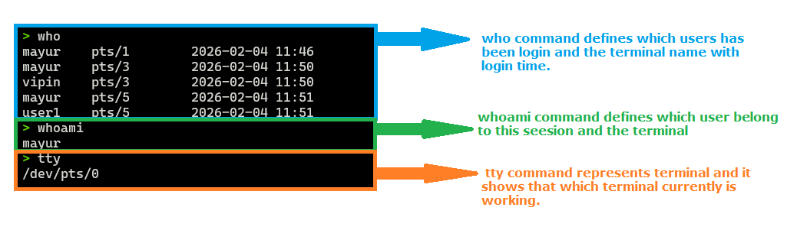
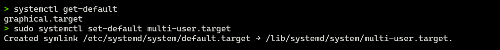

# Useful Linux Commands.

#### 1. Date : to display the current date and time we use the date command: `date`

---

#### To change the system date, you must login as a root user and change the date in the following format.

`date 12417052020.30`

- Explanation of above format is as follows:

---

### The Word Count Command in linux

#### 1. `wc file1`

- This will display the number of lines, words and characters in file.

  

- if you want any specific thing then you just mention the mode and it will display only related information.

---

#### 2. `cal` command: (current month calendar)

#### 3. `cal -3` last, current and next calendar.

---

### 4. pwd (present working directory)

- It will show present working directory, that is full
  path of current location.
  

---

#### To see the huge data on the screen we use less or more command.

#### 1. The `more` command : The more is reading utility in Linux where you can see the data line by line or next screen but not in the up direction.

---

#### 2. The `less` is the powerful command than `more` command because it goes in the both direction upward and downward to read the data.

- up arrow ⬆ to move upward direction to see the data.
- down arrow ⬇ to move downard directio to see the data.
- space bar key 󠀠󠀠➖ to move towards next screen.
- enter key ↵ to move towards next line.
- q key for quit

#### One of the most controlled command to read the data and hence mostly used to read the big file data in Linux.

---

#### Variables in Linux are Key-Value pair

#### 1. variable example

- `flower=rose` : We are declaring variable flower having value as a rose.

- To check the variable value we use $ symbol infront of the variable to see the actual value of it.
  `echo $flower`

---

#### The Linux also has the in-built variables as follows

- 1. $HOME : user's HOME value
- 2. $PWD : the current relative path

#### the `echo ~` command will show you the user's home directory, $HOME is abbereivated as tilde.

### Note:

#### The variables declared by the user are always in the "SMALL CASES" like `$flower`

#### The variables decalred by the system are always in the "UPPER CASES" like `$HOME`

---

### How to check the which is the current terminal in use and by which user then use command `tty` for the same.

---

#### The default boot load of any system is checked by the following command.

- `systemctl get-default`

#### The default boot load can be modify by the following command.

- `systemctl set-default <target_name>`
- e.g. `systemctl set-default multi-user.target`

#### Note: If default booting mode is GUI (graphical.target) then only 5 text virtual console plus 1 graphic console is available on `(<ctrl + alt + F1>)` these consoles can be accessed by using the keys from (F1 to F6) keys.

#### Defualt GUI Mode (graphical.target)

`<ctrl + alt + f1>` graphic console (pts)
`<ctrl + alt + f2>` virtual console 2 (tty1)
`<ctrl + alt + f3>` virtual console 3 (tty2)
`<ctrl + alt + f4>` virtual console 4 (tty3)
`<ctrl + alt + f5>` virtual console 5 (tty4)
`<ctrl + alt + f6>` virtual console 6 (tty5)

#### If you are default booting mode is text (multi-user.target), then default virtual 6 consoles are available. You can get the graphical console by running "startx" on "tty1", then graphic console will be available on `(<ctrl> + alt + F1)`

#### Defualt text Mode (multi-user.target)

`<ctrl + alt + f1>` graphic console (tty1)
`<ctrl + alt + f2>` virtual console 2 (tty2)
`<ctrl + alt + f3>` virtual console 3 (tty3)
`<ctrl + alt + f4>` virtual console 4 (tty4)
`<ctrl + alt + f5>` virtual console 5 (tty5)
`<ctrl + alt + f6>` virtual console 6 (tty6)

---
