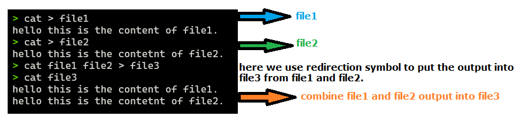
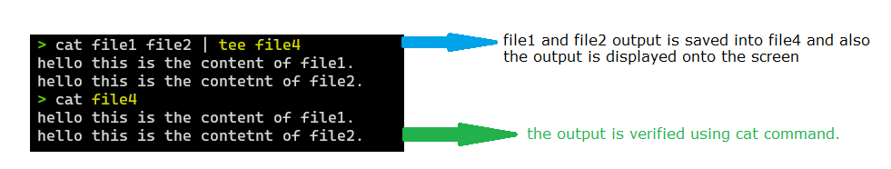

# Redirecting OUTPUT

### Case 1: Combine the Data of two files into 3rd file to see the Data of first file and Second file at once into a 3rd file.

---

### Case 2: Find that how many users are currently logged in.

- in above case, the who command finds that how many users are logged in and it redirects the output to the wc command to count the users which are presented at each line. The output redirected to the wc command.

### Note:

- sending the output to the command we use, `|` pipe symbol.
- sending the output to the file we use, `>` greater than symbol.

### Case 3 : If you want to send the output to the file and see what has been sent to the file on console then use `tee` command in linux.

## 

---
