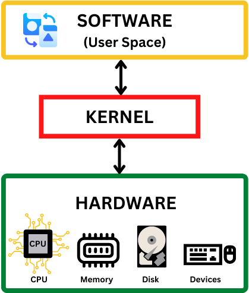
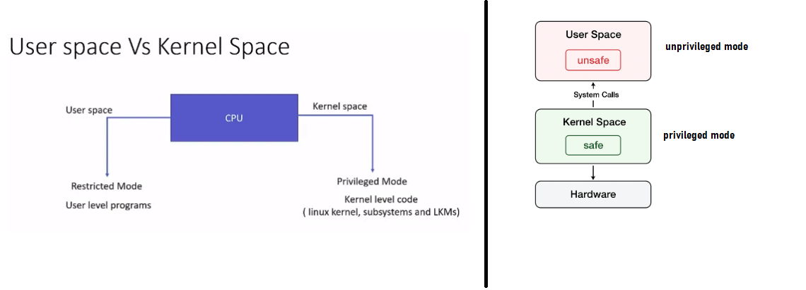
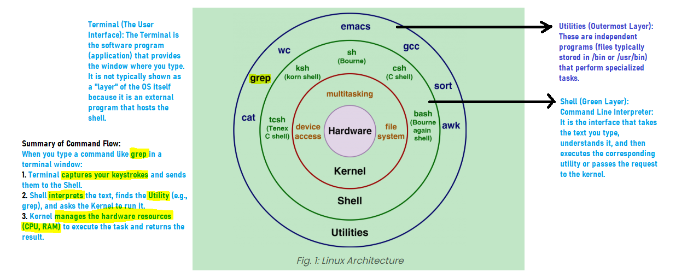
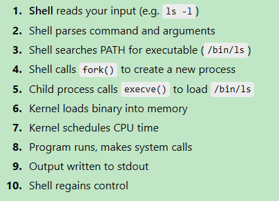

# What is Linux?

- The linux is `the Kernel` not Full Operating System.
- It manages CPU, memory, devices, processes, security. Nothing else.
- For example 'Ubuntu = Linux + Userspace'

# What is Kernel?

- A kernel is the core, central part of an operating system (OS) that acts as a bridge between software applications and computer hardware, managing essential system resources like the CPU, memory, and devices, and handling fundamental tasks such as process scheduling, memory allocation, and input/output operations to ensure everything runs smoothly and efficiently.

### Think of Kernel As:

- Resource Manager.
- Security Enforcer.
- Traffic Cop Between Processes.

---

# What is Userspace in Linux?

- Userspace is the protected area of a computer's memory where all your regular programs, like web browsers and games, run separately from the core operating system.
- It keeps the system safe by preventing these programs from touching sensitive hardware or memory directly, forcing them to ask the system's "boss" (the kernel) whenever they need to perform a task.
- This separation ensures that if one program crashes, it doesn't break the rest of the computer.

---

# What is `Shell` in a Linux?

- Shell is a `program` that acts as an interface between the user and the operating system's kernel, the core of the OS.
- The User interact with shell using `Terminal`. The `Terminal` is a text-based input/output emulator (e.g: `GNOME Terminal, PowerShell, CMD`).
- The `Shell` (e.g., Bash, Zsh) acts as the intermediary, receiving the text from the terminal.
- The `Shell` makes a `System Call` (e.g., open(), fork(), exec()) to request the Kernel to perform the task.
- The `Kernel` receives the system call, which is the official request from a user-level program to access restricted resources.
- The `Kernel` sends the results (data or errors) back to the Shell.

---

# What happens when you press `Enter` after a command?

---

# 1️⃣ Difference between Linux, Distribution, Shell

- Linux
  → The kernel.
  Manages CPU, memory, devices, processes, security. Nothing else.
- Distribution
  → Linux kernel + userspace tools + package manager + defaults
  Examples: Ubuntu, RHEL, Debian
  This is what people usually call “an OS”.
- Shell
  → A userspace program that:
  - Reads your input
  - Parses it
  - Launches other programs
  - Is replaceable (bash, zsh, fish)

# 2️⃣ What is a system call?

- A system call is a `controlled entry point` where a userspace program asks the kernel to perform a `privileged operation` on its behalf.
- Examples:
  - Read a file
  - Allocate memory
  - Create a process
  - Send network data
- Key insight:
  - Userspace cannot execute kernel instructions.
  - System calls switch CPU from user mode → kernel mode.

# 3️⃣ Why can’t a normal program access hardware directly?

- Direct hardware access would allow any bug or malicious code to take down the entire system.

# 4️⃣ What is /bin/ls really?

- /bin/ls is a compiled executable binary program that implements the ls command.

#### Flow:

- Shell reads `ls`
- Shell checks `$PATH`
- Finds `/bin/ls`
- Executes it via `execve()`

#### Important:

- `ls` is not built into the kernel.
- `ls` is not a shell feature.
- It’s just a program like any other.

---
