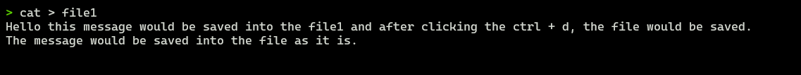
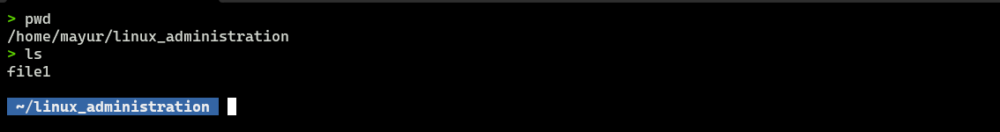
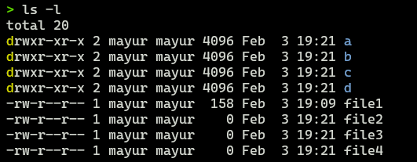
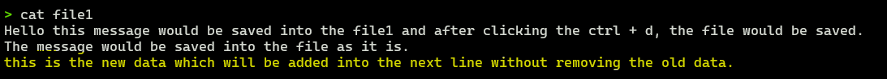
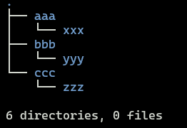
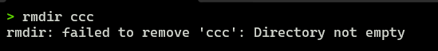
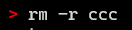
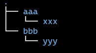

# Files and Directories

### 1. `cat > file1`

- cat is the basic utility to create files. You have to specify the "name of file" after > symbol
- press ctrl + d for saving the file.

#### file creation example (before saving)

#### file after saving (after pressing ctrl + d) and checked using the following command.

- `cat file1`

---

### How to create a directory

- `mkdir <directory_name>`
- e.g. `mkdir test`

---

### How to list the files into the directory

#### 1. By using `ls` command to list the contents

#### 2. By using `ls -l` command to get the detailed information about the files/directories.

---

#### How to recognize file and directories in Linux?

- By checking the first character.
- First character represents that the status of both for file and directory.
- For file it shows the symbol `-`
- For directory it shows the character `d`

---

### the file creation using the cat command has the following limitation.

#### When you create the file using cat command it does not append the data every time it overwrites the data.

- for example. when we put the new data into the same file which was earlier created by us as file1, the new data will be written only into the file and the old data would be vanished.

- be careful when you want to put data second time into the same file.
- for example.
  `cat > file1` -> your new data -> ctrl + d (save file). Old data would be completely vanished. ❌

#### Solution on the above factor is by using the >> character symbol to append the new data into the file.

- `cat >> file1`
- This command will not remove your old data and it will add new data into the file without any hesitation.

---

### Creating more directories

- creating the directory structure at once, it is possible in the linux but not into the windows operating system.

- for example
  `mkdir aaa bbb ccc aaa/xxx bbb/yyy ccc/zzz`

  

- displaying the created directory structure

---

#### to remove the file or files we have the following command

`rm <file_name>'

#### to remove the directory we have the following command

`rmdir <directory_name>`

#### Note: We only remove the empty directory by using the rmdir command however, if something present into the directory like directory into directory or nested directory then we have to remove the all directories present in the directory and then remove that directory.To perform this operation we will use the following command with option -r (to recursively remove the nested structure)

### The solution is: `rm -r ccc`

#### after applying the -r (recursive mode)

