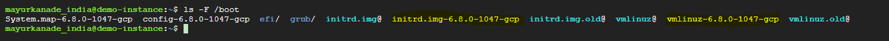
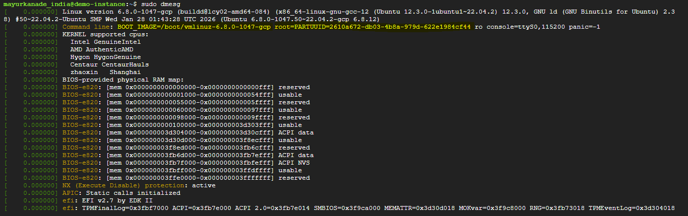
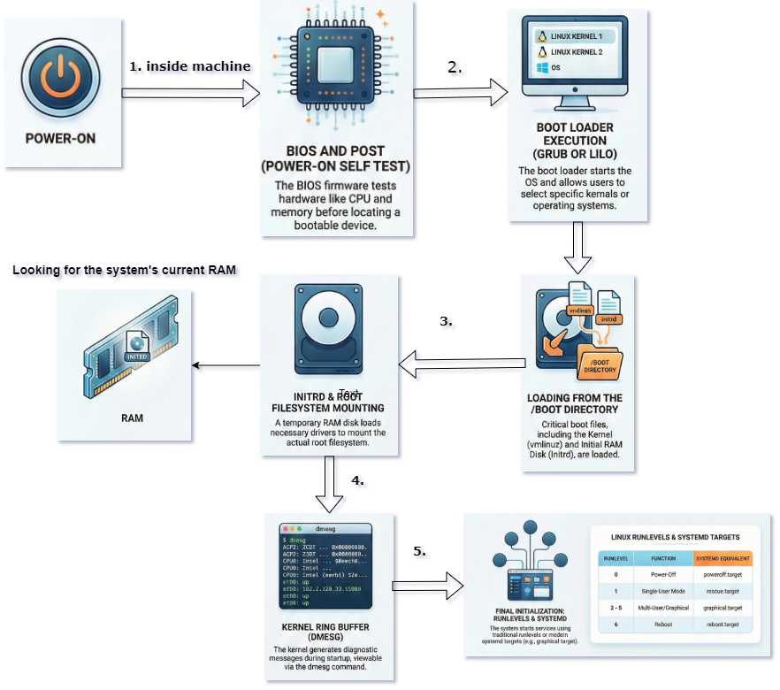

# What we will learn here:

1. BIOS
2. Boot Loaders
3. Linux Kernel
4. Runlevels

---

# 1. BIOS

- `BIOS` stands for `basic input/output system`.
- It is a special type of `firmware`. It is first piece of software that run when the computer is powered ON.
- It's primary pupose to test the underlying hardware components and to load the boot loader or operating system.
- The BIOS perform `POST (Power ON Self Test)`, the POST performs the various hardware checks such as CPU, memory and storage devices.
- Only if the POST succeeds then BIOS attempts to load the boot loader.
- The BIOS consist of list of Boot Devices such as HDD (Hard Disks), USB drivers, DVD drive, and others depending on the hardware being used.
- The BIOS searches that list for bootable device in order specified.
- Once the bootable device has been found the BIOS will run the boot loader, typically, the `GRUB` boot loader will be used. The Linux system that still use `LILO` boot loader. `LILO` stands for `Linux Loader`. `GRUB stands for Grand Unified Boot Loader`.
- The primary purpose of boot loader is to `start the operating system`, typically we see the series of messages from the boot loader that will allow you to interrupt the boot process and interact with boot loader.
- If you installed multiple operating system then you can tell the boot loader which operating system to run.
- The initial RAM disk, abbereviated `initrd` is a temporary file system that's loaded into the memory when the system boots.
- This file system can contains helpers that performs hardware detection and load the necessary modules, sometimes called drivers, to get the actual file system mounted. for example: if the root file system is stored on a LVM volume, or `Logical Volume Manager`. The `initrd` image will contain the kernel modules required to mount that logical volume as root file system.
- Once the `initrd  (Initial RAM Disk)` mount that logical volume as root file system then it's job is done and the operating system continues loading from real root filesystem.
- The linux kernel, initial RAM disk and other files needed to boot the operating system are stored in the /boot.
- /boot directory:
  - contains the files required to boot Linux
  - initrd
  - kernel (The kernel typically named `vmlinux` or `vmlinuz`)
  - boot loader configuration.

- The RAM disk in the above example is `initrd.img-6.8.0-1047-gcp` and
- If the kernel is compressed then it's named as `vmlinuz` ends in `z`. In this example we have the kernel is compressed and named as `vmlinuz-6.8.0-1047-gcp`
- The kernel ring buffer contains messges related to the linux kernel. A ring buffer is a `data structure` that is always the same size. Once the buffer is completely full, old messages are discarded when new messages arrive.
- To see the contents of the kernel ring buffer we use `dmesg` command.
  
- In most Linux, these message are stored on the following path:
  `/var/log/dmesg`
- Between `dmesg` command and `/var/log/dmesg` log file, you will be see the messages the kernel is generating even during the earliest stages of the boot process, when those messages can quickly fly by your screen on boot up.
- Linux uses `runlevels` to determine what processes and services to start. Each distribution can be configured differently but in general `runlevel 0` is used to Power-Off the system and `runlevel 1` is Single-User mode. The `runlevel 2 to 5` are for normal system operations, and `runlevel 6` is used to reboot the system.
- Traditionally, the `runlevel` programs were controlled by the `init` program.
- The init configuration is stored in `/etc/inittab`.
- To change the default `runlevel` using init, you would edit the `/etc/inittab` file and set the runlevel number on the `initdefault` line.
- However, the init alternatives such as `systemd and upstart` are quickly taking the place of init, with `systemd` currently being most widely adopted replacement.
- cd `/lib/systemd/system`
- ls -l runlevels15.target
- runlevel targets are actually `symlinks` to the real targets being used.
  for example `runlevel5.target` is a symlink to graphical target.
- to change the default `runlevel` we use the following command:
  `systemctl set-default graphical.target` and the finally the desired target.

---

- With `init` system you can change `runlevels` using `telinit` command.
- Simply supply the runlevel you want to change to the telinit command
  for example `telinit 5`
- To change the target to the runlevel equivalent for systemd, use the systemctl command followed by isolate and finally the desired target.
  for example: `systemctl isolate graphical.target`

---

#### runlevel for rebooting or target for rebooting using systemd, you can also use reboot or shutdown command.

- `telinit 6`
- Reboot using systemctl with mentioning target -> `systemctl isolate reboot.target`
- To reboot using reboot command -> `reboot`

---

#### to format of the shutdown command is on shown on your screen

#### Syntax: `shutdown [options] time [message]`

- Here, the option to tell shutdown to perform a reboot is `-r`, you can specify the time to shutdown using the `hour hour:minute minute`, you can also use `+n` represents `the number of minutes to wait` before performing action.
- You can also use `now` keyword to start the reboot process immediately.

- Examples:
- 1. `shutdown -r 15:30 "rebooting"`
- 2. `shutdown -r +5 "rebooting soon!"`
- 3. `shutdown -r now`

#### you may also specify the `wall message` that will be broadcasted to all users logged into the system.

#### To power-off the system, use `runlevel 0`, the power-off target, or the power-off.

- `telinit 0`
- `systemctl isolate poweroff.target`
- `poweroff` -> this is the direct command to power-off your machine.

---

---

#
