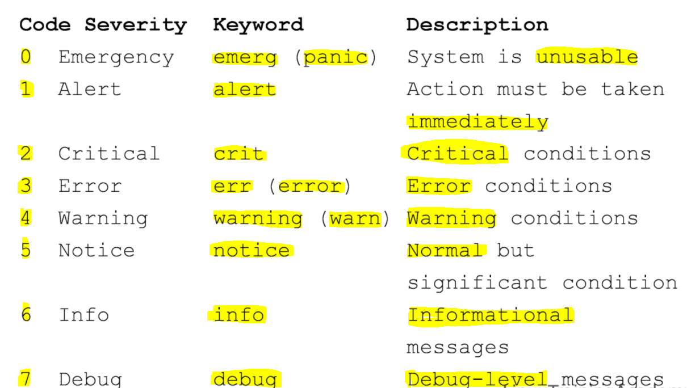

# System Log

#### The following topics would be covered.

- The syslog standard
- Facilities and Severities
- Syslog servers
- Logging rules
- Where logs are stored
- How to generate your own log messages.
- Rotating log files.

---

### 1. The linux uses the syslog standard for message logging.

- It aids in the processing of messages.
- It allows logging to be centrally controlled.
- Uses facilities and severities to categorize messages. Each message is labled with facility code and severity level.
- The various combinations can be used to determine how message is handled.
- Facilities are used to indicate what type of program or what part of the system the message is originated from.
- For example, messages are labeled with `current facility` originate from the Linux Kernel. The messages that are labeled with `mail facility` come from applications involved in handling mail.
- Each facility has a number and a keyword associated with it.
- Local facilities are from `local0 to local7`, you can use this for your own custom applications.

### 2. The syslog servers: Accepts the syslog messages.

- A syslog messages server accepts the syslog messages and processes those messages
  based on the set of configurable rules.
- Traditionally, the syslogd `daemon` filled this role but many linux distributions ship alternatives such as `rsyslog` and `syslog-ng`
- The main configuration file of `rsyslog` is `/etc/rsyslog.conf`
  you can include additional configuration files by using the `$IncludeConfig` directive.
  for example: `$IncludeConfig /etc/rsyslog.d/*.conf` This line will cause rsyslog
  to read and include all configuration files that end in .conf and that also existing in the `/etc/rsyslog.d` directory.

---

#### Logging rule consist of two fields: 1. Selector field and 2. Action field.

#### `1.Selector Field`

- FACILITY.SEVERITY
- mail.\*
- mail
- FACILITY.none
- FACILITY_1.SEVERITY ; FACILITY_2.SEVERITY

#### `2.Action Field`

- Determines how message is processed.

#### The most common action is to write the messages to the log file. The selector field and action field can be separated by one or more spaces or tabs.

#### The format of the selector field is FACILITY.SEVERITY also note that wild cards are supported. for example for all `mail messages` we use `mail.*`

- Example logging rule : `mail.*` -> `/var/log/mail.log`

---

#### VIMP: if the path start with `-` minus symbol, then that means syslog doesn't have to perform a sync operation for each log message.

- caching is used if the path start with a hypen for example:
  `mail.info` --> `-/var/log/mail.info`
- when using caching mode, some messages might be lost if a system crashes immediately after a write attempt. However, you may see the performance imporvements during normal operations if you have a system that performs many logging operations.
- The default configurations that ship with a linux distribution will probably have
  mix of caching and non-caching rules with less critical message using caching.
- Using caching mode can improve I/O performance.

#### Example Logging Rules.

- `mail.info` --> `-/var/log/mail.info`
- `mail.warn` --> `-/var/log/mail.warn`
- `mail.err` --> `/var/log/mail.err`

#### Notice the last mail.err message is critical mail messages are using caching mode.

#### Example of Logging Rules

1. `auth, authpriv.*` --> `/var/log/auth.log`

Here, the all messages from auth and authpriv facilities are written to /var/log/auth.log

2. `*.*; auth.none; authpriv.none` --> `-/var/log/syslog`

Here, all messages except ones originating from the auth and authpriv facilities to /var/log/syslog

#### Example from RED-HAT enterprise linux system:

1. `*.info;mail.none;authpriv.none;cron.none` --> `/var/log/messages`

This rule tells `rsyslog` to write all messages except mail,authpriv and cron to /var/log/messages

---

### logger command is to generate syslog messages.

### Syntax : `logger [options] message`

#### [options] : -p FACILITY.SEVERITY , -t TAG

If you do not use FACILITY.SEVERITY pair then it will default to `user.notice`

- You can also use -t option to tag your message.

#### In this example we generate a message with mail facility at severity level of info. You can see the message made its way to the proper log file.

#### You can use logrotate tool to rotate,compress,remove and even mail log files.

#### This provides an automated way to manage log files

`/etc/logrotate.conf` include `/etc/lograte.d`

- It can prevent your stoarge space with log messages.
- The configuration files for the logrotate is located at `/etc/lograte.conf`

#### Example of logrotate.conf

weekly
rotate 4
create
compressed
include `/etc/logrotate.d`

- Here, weekly mentioned that the log file will be roated every week.
- rotate 4 line tells `logrotate to keep 4 weeks` worth of logs, logs older than 4 weeks will be removed.
- the create line make sure that a new empty log file is created after it is rotated.
- Sample log-rotation file from Ubuntu.

- The above image displays a logrotate configuration file, a standard Linux system utility used to automatically rotate, compress, and manage log files to prevent them from consuming excessive disk space.
- File Overview
  The configuration specifically targets two system log files: `/var/log/debug` and `/var/log/messages`. It outlines a schedule and set of rules for how these logs should be archived and maintained.
- Detailed Directive Breakdown
- Each line in the file (called a directive) controls a specific part of the rotation process:

1. `rotate 4`: Keeps the four most recent archived logs. When a fifth rotation occurs, the oldest one is deleted.
2. `weekly`: Rotates the log files once every week.
3. `missingok`: If a log file is missing, the utility will move to the next one without issuing an error message.
4. `notifempty`: Prevents rotation if the log file is currently empty.
5. `compress`: Compresses old log files (typically into .gz format) to save storage space.
6. `sharedscripts`: Ensures that any scripts in the postrotate block run only once for the entire group of logs, rather than once for each individual file.
7. `postrotate / endscript`: This block contains a script that runs immediately after the rotation is complete.
8. `reload rsyslog ...`: This specific command reloads the rsyslog service so it can begin writing to the newly created, empty log files.

- These resources describe how logrotate manages log files using directives such as "rotate", "weekly", "compress", "missingok", "notifempty", and "postrotate":

#### To test the log rotate configuration use the following command:

`logrotate -fv /etc/logrotate.conf`

- `[option f]` - tells logrotate to force a rotation.
- `[option v]` - tells logrotate the verbose logging.

---

## 
